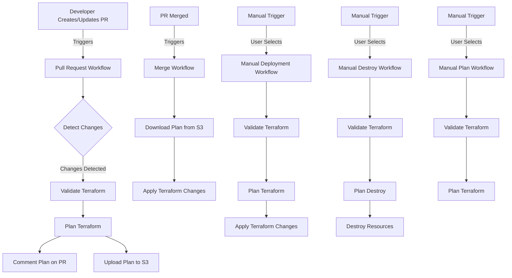

# Kafka POC Repository

## Terraform Workflows

This repository contains a set of GitHub Actions workflows for managing Terraform deployments. These workflows automate the process of planning, applying, and destroying Terraform configurations across different environments.

### Table of Contents

- [Workflows Overview](#workflows-overview)
- [Workflow Diagram](#workflow-diagram)
- [Usage](#usage)
  - [Pull Request Workflow](#pull-request-workflow)
  - [Merge Workflow](#merge-workflow)
  - [Manual Deployment](#manual-deployment)
  - [Manual Destroy](#manual-destroy)
  - [Manual Plan](#manual-plan)
- [Reusable Workflows](#reusable-workflows)
- [Configuration](#configuration)
- [Security Notes](#security-notes)
- [Best Practices](#best-practices)

### Workflows Overview

1. **Pull Request Workflow**: Runs Terraform plan when a PR is opened or updated.
2. **Merge Workflow**: Applies Terraform changes when a PR is merged.
3. **Manual Deployment**: Allows manual triggering of Terraform apply for specific environments.
4. **Manual Destroy**: Provides a way to manually destroy Terraform-managed resources.
5. **Manual Plan**: Allows manual triggering of Terraform plan for internal testing.

### Workflow Diagram

The following diagram illustrates the high-level flow of the main workflows:

This diagram provides a visual representation of how the different workflows interact and the steps involved in each process.

### Usage

#### Pull Request Workflow

This workflow is automatically triggered when a pull request is opened, edited, reopened, synchronized, or marked as ready for review on the `main` branch.

- It detects changes in Terraform configurations.
- Runs `terraform validate` and `terraform plan`.
- Posts the plan as a comment on the PR.
- Uploads the plan to S3 for later use.

#### Merge Workflow

This workflow is automatically triggered when a pull request is merged into the `main` branch.

- It detects which folders have changes.
- Downloads the previously generated plan from S3.
- Applies the Terraform changes using the downloaded plan.

#### Manual Deployment

This workflow can be manually triggered from the GitHub Actions UI.

1. Go to the "Actions" tab in your GitHub repository.
2. Select "Manual Terraform Deployment" workflow.
3. Click "Run workflow".
4. Choose the environment (`dev`) from the dropdown.
5. The workflow will validate, plan, and apply the Terraform configuration for the selected environment.

#### Manual Destroy

This workflow can be manually triggered to destroy Terraform-managed resources.

1. Go to the "Actions" tab in your GitHub repository.
2. Select "CAUTION: Manual Terraform Destroy" workflow.
3. Click "Run workflow".
4. Choose the environment (`dev`) from the dropdown.
5. The workflow will validate, plan the destruction, and then destroy the resources for the selected environment.

#### Manual Plan

This workflow allows for manual triggering of Terraform plan for internal testing.

1. Go to the "Actions" tab in your GitHub repository.
2. Select "Manual Terraform Plan" workflow.
3. Click "Run workflow".
4. Choose the environment (`dev`) from the dropdown.
5. The workflow will validate and plan the Terraform configuration for the selected environment.

### Reusable Workflows

The repository also contains several reusable workflows that are called by the main workflows:

- `terraform_validate.yml`: Validates Terraform configurations.
- `terraform_plan.yml`: Generates and uploads Terraform plans.
- `terraform_apply.yml`: Applies Terraform changes.
- `terraform_plan_destroy.yml`: Generates destroy plans.
- `terraform_destroy.yml`: Executes Terraform destroy.

### Configuration

The workflows use several GitHub Actions variables and secrets:

- `TF_VERSION`: The version of Terraform to use.
- `AWS_REGION`: The AWS region for deployments.
- `AWS_ASSUME_ROLE`: The ARN of the AWS role to assume for AWS operations.
- `TFPLAN_S3_BUCKET`: The S3 bucket where Terraform plans are stored.
- `TF_MODULES_REPO_TOKEN`: A GitHub token with access to private Terraform modules.

Ensure these are properly set in your GitHub repository settings before running the workflows.

### Security Notes

- The workflows use OIDC to authenticate with AWS, enhancing security by avoiding long-lived credentials.
- Sensitive operations like destroy are protected by requiring manual trigger and providing clear warnings.
- Plans are stored in S3 with server-side encryption enabled.

### Best Practices

- Always review the plan output in pull requests before merging.
- Use branch protection rules on the `master` branch to ensure changes go through the PR process.
- Regularly audit who has permission to run manual workflows, especially the destroy workflow.

For any questions or issues, please open a GitHub issue in this repository.